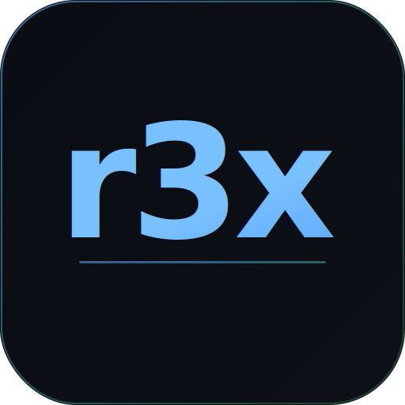

<p align="center">
  
</p>

<h1 align="center">r3x</h1>

<p align="center">
  <strong>Lightweight Kubernetes cockpit with security built in.</strong><br/>
  The speed of k9s. The visuals of Lens. None of the bloat.
</p>

<p align="center">
  <a href="https://rebash.in">rebash.in</a> &middot;
  <a href="#installation">Installation</a> &middot;
  <a href="#features">Features</a> &middot;
  <a href="#keyboard-shortcuts">Keyboard Shortcuts</a> &middot;
  <a href="#building-from-source">Build from Source</a>
</p>

<p align="center">
  
  
  
  
</p>

---

## Why r3x?

| | k9s | Lens | r3x |
|---|---|---|---|
| **UI** | Terminal only | Full GUI | Full GUI |
| **Memory** | ~30MB | ~500MB+ | ~30MB |
| **Bundle size** | ~30MB | ~400MB | ~17MB |
| **Startup** | <1s | 5-10s | <1s |
| **Runtime** | Go | Electron | Tauri (Rust + native webview) |
| **Security scanning** | No | Paid | Built-in |
| **Keyboard-first** | Yes | No | Yes |

r3x gives you a real GUI with the resource efficiency of a terminal app. No Electron. No subscription. Just a fast, native Kubernetes cockpit.

---

## Features

### Resource Management
- **15 resource types** — Pods, Deployments, Services, StatefulSets, DaemonSets, ReplicaSets, Jobs, CronJobs, ConfigMaps, Secrets, Ingresses, NetworkPolicies, ServiceAccounts, PVCs, Nodes
- **Custom Resources (CRDs)** — Auto-discovers and browses any CRD in your cluster
- **Multi-cluster** — Switch between kubeconfig contexts instantly
- **Namespace filtering** — Browse all namespaces or focus on one
- **Label filtering** — Filter resources by Kubernetes label selectors (e.g., `app=nginx,env=prod`)
- **Auto-refresh** — Configurable polling interval to keep resources up to date
- **Sorting & search** — Column sorting, full-text search across all visible fields

### Inspection
- **YAML viewer** — View the full YAML spec of any resource
- **Real-time log streaming** — Stream pod logs with container selection and keyword filtering
- **Log export** — Download logs as text files
- **Events timeline** — View Kubernetes events for any resource
- **Pod exec terminal** — Interactive shell into running containers via integrated terminal

### Operations
- **Scale deployments** — Scale replicas up/down directly from the UI
- **Port forwarding** — Forward local ports to pods/services
- **Delete resources** — Remove resources with confirmation

### Cluster Views
- **Cluster Dashboard** — Node count, pod count, CPU/memory utilization with per-node breakdown
- **Topology graph** — Visual tree of Controllers → ReplicaSets → Pods → Containers
- **Helm releases** — View all Helm releases with status, chart version, and revision history
- **RBAC viewer** — Inspect ClusterRoleBindings and RoleBindings with subject details

### Security
- **Security scanner** — Detects misconfigurations across your workloads:
  - Privileged containers
  - Running as root
  - Privilege escalation
  - Host network/PID/IPC access
  - Dangerous capabilities (SYS_ADMIN, NET_RAW, etc.)
  - Missing resource limits
  - `latest` image tags
  - Missing health probes
  - Default service account usage
  - Writable root filesystem
- **Security score** — 0-100 score with severity breakdown (Critical / High / Medium / Low)
- **Filterable findings** — Filter by severity, category, or search

### Resource Benchmarking
- **CPU & memory recommendations** — Analyzes actual usage metrics and recommends right-sized requests and limits
- **Percentile-based** — Uses P50 for requests, P99 for limits, with safety margins

### Command Palette
- **k9s-style command mode** — Press `:` to open, type commands like:
  - `:pods`, `:deploy`, `:services` — switch resource type
  - `:ns default`, `:ns kube-system` — switch namespace
  - `:ctx my-cluster` — switch context
  - `:helm`, `:rbac`, `:dashboard`, `:topology`, `:security` — open views

### Quality of Life
- **Dark / Light theme** — Toggle with `t`
- **Keyboard-first navigation** — Full keyboard control, mouse optional
- **Tiny footprint** — ~17MB app bundle, ~30MB RAM at runtime

---

## Installation

### macOS

Download the latest `.dmg` from [Releases](https://github.com/rebash-rebash/r3x/releases), open it, and drag **r3x** to your Applications folder.

Or build from source:

```bash
git clone https://github.com/rebash-rebash/r3x.git
cd r3x
npm install
cargo tauri build
open src-tauri/target/release/bundle/macos/r3x.app
```

### Windows

Download the latest `.msi` or `.exe` installer from [Releases](https://github.com/rebash-rebash/r3x/releases).

Or build from source:

```bash
git clone https://github.com/rebash-rebash/r3x.git
cd r3x
npm install
cargo tauri build
# Installer at: src-tauri\target\release\bundle\nsis\r3x_0.1.0_x64-setup.exe
```

### Linux

Download the latest `.AppImage` or `.deb` from [Releases](https://github.com/rebash-rebash/r3x/releases).

---

## Prerequisites

r3x reads your local kubeconfig (`~/.kube/config`). Make sure:

1. **kubectl** is configured and can reach your cluster
2. **Helm** (optional) — required for Helm releases view (`helm` must be in PATH)
3. **Metrics Server** (optional) — required for CPU/memory metrics and benchmarking

---

## Keyboard Shortcuts

| Key | Action |
|-----|--------|
| `:` | Open command palette |
| `/` | Focus search |
| `Up/Down` | Navigate resources |
| `Enter` | Select / expand resource |
| `Esc` | Close panel / deselect |
| `1`-`9` | Switch resource kind |
| `r` | Refresh resources |
| `t` | Toggle dark/light theme |
| `j` / `Arrow Down` | Focus first resource row |

---

## Building from Source

### Requirements

- **Rust** (stable) — [Install via rustup](https://rustup.rs/)
- **Node.js** 18+ — [Install via nvm](https://github.com/nvm-sh/nvm) or [nodejs.org](https://nodejs.org/)
- **System dependencies** (platform-specific):

#### macOS
```bash
xcode-select --install
```

#### Windows
- [Microsoft Visual Studio C++ Build Tools](https://visualstudio.microsoft.com/visual-cpp-build-tools/)
- [WebView2](https://developer.microsoft.com/en-us/microsoft-edge/webview2/) (pre-installed on Windows 10/11)

#### Linux (Debian/Ubuntu)
```bash
sudo apt install libwebkit2gtk-4.1-dev build-essential curl wget file libxdo-dev libssl-dev libayatana-appindicator3-dev librsvg2-dev
```

### Build

```bash
# Clone
git clone https://github.com/rebash-rebash/r3x.git
cd r3x

# Install frontend dependencies
npm install

# Development (hot-reload)
npm run tauri dev

# Production build
cargo tauri build
```

Build outputs:
- **macOS**: `src-tauri/target/release/bundle/macos/r3x.app` and `.dmg`
- **Windows**: `src-tauri/target/release/bundle/nsis/r3x_*-setup.exe` and `.msi`
- **Linux**: `src-tauri/target/release/bundle/deb/*.deb` and `appimage/*.AppImage`

---

## Architecture

```
r3x/
├── src/                    # Frontend (SolidJS + TypeScript)
│   ├── components/         # UI components
│   │   ├── Sidebar.tsx         # Resource kind navigation
│   │   ├── Header.tsx          # Context/namespace switcher, search, filters
│   │   ├── ResourceTable.tsx   # Main resource list with sorting
│   │   ├── DetailPanel.tsx     # YAML, logs, exec, events, metrics
│   │   ├── CommandPalette.tsx  # k9s-style command mode
│   │   ├── ClusterDashboard.tsx# Cluster metrics overview
│   │   ├── TopologyPanel.tsx   # Workload topology tree
│   │   ├── SecurityPanel.tsx   # Security scan results
│   │   ├── HelmPanel.tsx       # Helm releases viewer
│   │   ├── RbacPanel.tsx       # RBAC bindings viewer
│   │   └── Terminal.tsx        # xterm.js pod exec
│   ├── stores/
│   │   └── k8s.ts              # Central state (signals + Tauri IPC)
│   └── styles/
│       └── global.css          # All styles (~32KB)
├── src-tauri/              # Backend (Rust)
│   └── src/
│       └── k8s/
│           ├── resources.rs    # Resource listing (15 types + CRDs)
│           ├── context.rs      # Kubeconfig context management
│           ├── logs.rs         # Log streaming
│           ├── exec.rs         # Pod exec via WebSocket
│           ├── security.rs     # Security misconfiguration scanner
│           ├── topology.rs     # Workload topology builder
│           ├── metrics.rs      # Cluster metrics aggregation
│           ├── benchmark.rs    # Resource recommendation engine
│           ├── helm.rs         # Helm CLI integration
│           ├── rbac.rs         # RBAC binding queries
│           ├── events.rs       # Kubernetes events
│           ├── nodes.rs        # Node details
│           ├── portforward.rs  # Port forwarding
│           ├── scale.rs        # Deployment scaling
│           └── crds.rs         # CRD discovery
└── package.json
```

**Frontend** communicates with **Backend** via Tauri IPC (invoke/listen). All Kubernetes API calls happen in Rust via [kube-rs](https://github.com/kube-rs/kube). The frontend never touches the network directly.

---

## Tech Stack

| Layer | Technology |
|-------|-----------|
| Desktop framework | [Tauri 2.x](https://tauri.app/) |
| Backend | Rust + [kube-rs](https://github.com/kube-rs/kube) 0.98 |
| Frontend | [SolidJS](https://www.solidjs.com/) + TypeScript |
| Terminal | [xterm.js](https://xtermjs.org/) |
| Bundler | [Vite](https://vitejs.dev/) |

---

## Contributing

Contributions are welcome! Please open an issue first to discuss what you'd like to change.

```bash
# Fork & clone
git clone https://github.com/<your-username>/r3x.git
cd r3x
npm install
npm run tauri dev
```

---

## License

[MIT](LICENSE) - Made by [Rebash](https://rebash.in)